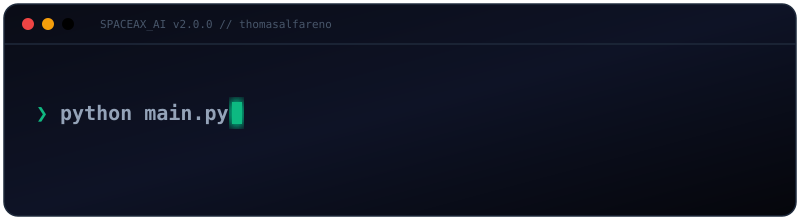
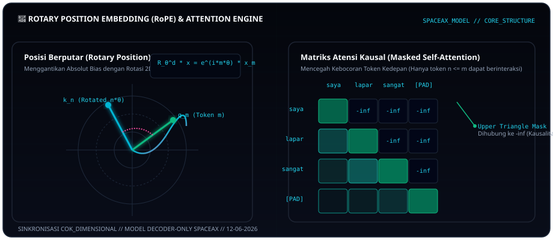

# SpaceAx AI v2.0.0



Mesin percakapan Bahasa Indonesia berbasis **Transformer decoder-only**, dilatih dari nol di mesin sendiri (bukan model siap pakai dari HuggingFace). Dibangun oleh **Thomas Alfareno Ananta Nugraha** — Teknik Informatika FTEIC ITS Surabaya, untuk **Space Ax Corp**.

**Repositori:** [github.com/thomasalfareno/SpaceAX-AI-BETA](https://github.com/thomasalfareno/SpaceAX-AI-BETA)  
**Versi:** 2.0.0

---

## Daftar Isi

1. [Gambaran Singkat](#gambaran-singkat)
2. [Arsitektur & Alur Sistem (Animated)](#arsitektur--alur-sistem-animated)
3. [Folder `kbbi/` & Sinkron Leksikon](#folder-kbbi--sinkron-leksikon)
4. [Struktur Folder & Modul](#struktur-folder--modul)
5. [Persyaratan Sistem](#persyaratan-sistem)
6. [Instalasi Windows](#instalasi-windows)
7. [Instalasi Linux](#instalasi-linux)
8. [Google Colab](#google-colab)
9. [Perintah CLI](#perintah-cli)
10. [ProMax 1B / 4B / 8B](#promax-1b--4b--8b)
11. [Ukuran Vocab Per Profil](#ukuran-vocab-per-profil)
12. [Training & Chat: Apa yang Wajar Diharapkan](#training--chat-apa-yang-wajar-diharapkan)
13. [Variabel Lingkungan](#variabel-lingkungan)
14. [Masalah Umum & Solusi](#masalah-umum)

---

## Gambaran Singkat

Clone proyek:

```bash
git clone https://github.com/thomasalfareno/SpaceAX-AI-BETA.git
cd SpaceAX-AI-BETA
```

Alur kerja biasa:

1. Clone repo → **ekstrak `kbbi/ekstrak.zip` sekali** (isi JSON KBBI + leksikon txt).
2. `pip install -r requirements.txt`
3. `python main.py train` — latih tokenizer BPE + model, simpan checkpoint di `data/checkpoints/`.
4. `python main.py chat` — ngobrol; model mencoba generate teks sendiri dulu, baru fallback jika output tidak layak.
5. (Opsional) `python main.py retrain` — gabung log chat ke dataset lalu latih ulang.

**Fitur Utama:** memori percakapan (STM/LTM), mesin emosi, **KBBI + leksikon lengkap** (slang, daftar kata, kata dasar), pencarian internet (`ddgs`), augmentasi anti-hafalan, skala **ProMax** (~1.2B / ~4B / ~8B parameter), flag **`--force`** untuk training tanpa early stopping.

---

## Arsitektur & Alur Sistem (Animated)

Berikut adalah visualisasi alur pemrosesan token dan routing kueri yang terintegrasi di dalam **SpaceAx AI CLI & Core Model**:



### Penjelasan Komponen Alur Kerja:
1. **Leksikon Preprocess (Pre-processing Engine):** Menerjemahkan bahasa gaul / tidak baku (*slang*) ke padanan kata baku yang terdaftar pada leksikon KBBI (`combined_slang_words.txt`). Contoh: `"gw mager bgt"` ➔ `"saya malas bergerak sangat"`.
2. **SpaceAx Model (Transformer Core):** Model decoder-only teroptimasi menggunakan RoPE (Rotary Position Embeddings) untuk mengalokasikan relasi token secara sirkular. Tingkatan ProMax mengemas parameter dari 1B hingga 8B.
3. **Core Controller (Memory & Emotion Engine):** STM memproses dynamic context window 5 giliran terakhir, sedangkan LTM (SQLite DB) menyimpan fakta-fakta penting. Mesin emosi memodifikasi representasi mood jawaban di output.
4. **Validator 3-Tingkat (Anti-Gibberish System):** Mencegah keluaran acak / cacat dari model baru (pada loss tinggi) dengan memverifikasi rasio vokal, leksikon KBBI, serta keselarasan kalimat. Jika gagal, memicu *fallback* pencarian web (`ddgs` / DuckDuckGo Search) untuk melengkapi pengetahuan model secara real-time.

### Visualisasi Detail Mekanisme RoPE & Atensi Kausal:



*   **Rotary Position Embedding (RoPE):** Menggunakan rotasi spasial 2 dimensi kompleks beraturan pada vektor query $q_m$ dan key $k_n$ berdasarkan posisi relatif $m-n$. Ini menghindari batasan posisi absolut tradisional dan mempertahankan pemahaman rentang context-window yang dinamis.
*   **Masked Causal Self-Attention:** Untuk model bertipe auto-regresif decoder-only, proses atensi mencegah bocornya informasi dari token masa depan dengan mengalikan elemen segitiga atas attention matrix dengan $-\infty$ sebelum fungsi softmax.

---

## Folder `kbbi/` & Sinkron Leksikon

### Wajib Sekali: Ekstrak `ekstrak.zip`

Di repo ada **`kbbi/ekstrak.zip`** (~10 MB). File JSON/txt KBBI **tidak** dipakai langsung — user harus ekstrak dulu ke folder `kbbi/` (hanya saat instalasi pertama).

Setelah ekstrak, `kbbi/` harus berisi antara lain `kbbi_v_part1.json` … `part4.json` dan file `.txt` leksikon. Baru jalankan `python main.py train`.

**Linux / Colab:**

```bash
unzip -q kbbi/ekstrak.zip -d kbbi/temp
mv kbbi/temp/* kbbi/
rm -rf kbbi/temp kbbi/ekstrak.zip
```

**Windows (PowerShell):**

```powershell
Expand-Archive -Path kbbi\ekstrak.zip -DestinationPath kbbi\temp
Move-Item kbbi\temp\* kbbi\
Remove-Item kbbi\temp -Recurse -Force
Remove-Item kbbi\ekstrak.zip
```

Cek cepat: `ls kbbi/kbbi_v_part1.json` (Linux) atau `dir kbbi\kbbi_v_part1.json` (Windows).

---

Semua file di `kbbi/` dipakai otomatis oleh `core/kbbi.py`:

| File | Fungsi |
|------|--------|
| `ekstrak.zip` | Arsip instalasi — **ekstrak sekali**, lalu boleh dihapus |
| `kbbi_v_part1.json` … `part4.json` | Definisi KBBI resmi (~112k entri) |
| `indonesian-words.txt` | Daftar kata Indonesia |
| `list_0.5.1.txt`, `list_1.0.0.txt` | Daftar kata tambahan (besar) |
| `combined_slang_words.txt` | JSON gaul→baku (mis. `gw` → `saya`) |
| `combined_root_words.txt` | Kata dasar |
| `combined_stop_words.txt` | Partikel / stop word (kaidah tata bahasa) |

**Ke mana datanya masuk:**

1. **Seed training** (`data/seed/conversations.json`) — ribuan pasangan: definisi, slang, leksikon, grammar.
2. **Tokenizer BPE** — corpus definisi + slang + sampel kosakata (~14 juta karakter).
3. **Chat** — tanya arti kata KBBI atau arti gaul (`apa arti gw`).

**Sinkron otomatis** saat `train` jika file di `kbbi/` lebih baru dari seed, atau jumlah pasangan `kbbi_*` di seed masih sedikit. **Paksa ulang:**

```bash
export SPACEAX_KBBI_SYNC=1
python main.py train --regen
```

Setelah menambah file KBBI baru, hapus checkpoint & vocab lama lalu `--regen` (ukuran embedding berubah jika vocab profil berubah).

---

## Struktur Folder & Modul

```
SpaceAX-AI-BETA/            # nama folder setelah git clone
├── main.py                 # CLI: train, chat, learn, retrain, test, chatdev
├── chat.py                 # UI terminal + generasi + fallback percakapan
├── requirements.txt
├── core/
│   ├── config.py           # Profil model (small→promax), training, path, deteksi RAM/GPU
│   ├── promax.py           # Sub-tier promax_1b / 4b / 8b
│   ├── model.py            # SpaceaxModel — Transformer decoder-only + RoPE
│   ├── tokenizer.py        # BPETokenizer (tokenizers HuggingFace)
│   ├── kbbi.py             # KBBI JSON + txt slang/list/root → seed & tokenizer
│   └── debug_log.py        # Log opsional (SPACEAX_DEBUG=1) → data/logs/
├── training/
│   ├── generate_seed_data.py   # conversations.json (math, emosi, dll.)
│   ├── seed_extra.py           # Topik tambahan (teknologi, budaya, coding massal)
│   ├── composition_variants.py # Variasi intent (anti hafal satu kalimat)
│   ├── text_augment.py         # Paraphrase on-the-fly
│   ├── dataset.py              # DataLoader + augmentasi dinamis
│   └── trainer.py              # Loop training, checkpoint, sample per epoch
├── learning/
│   ├── internet.py         # Pencarian & cache (ddgs)
│   ├── web_learner.py        # Belajar topik dari web
│   ├── knowledge_base.py     # Penyimpanan pengetahuan terstruktur
│   └── auto_trainer.py       # Hook auto-retrain (jika dipakai)
├── memory/
│   ├── memory.py             # STM buffer + LTM SQLite
│   └── vector_store.py       # Pencarian fakta mirip (embedding sederhana)
├── personality/
│   └── emotion_engine.py     # 9 emosi + decay + pengaruh gaya jawaban
├── data/
│   ├── seed/conversations.json
│   ├── checkpoints/model_best.pt, model_epoch_N.pt
│   ├── vocab/                # BPE tersimpan
│   ├── knowledge/              # Hasil internet
│   ├── memories/               # Memori & gaya user
│   └── conversation_logs/      # chat_history.json untuk retrain
└── kbbi/
    ├── ekstrak.zip           # ekstrak sekali saat instalasi → file di bawah
    ├── kbbi_v_part1.json …   # (hasil ekstrak)
    └── …                     # slang, list kata, root, stop words
```

### Peran Modul (Ringkas)

| Modul | Fungsi |
|-------|--------|
| `core/model.py` | Arsitektur neural; `generate()` untuk inferensi token demi token. |
| `core/kbbi.py` | Muat leksikon, `enrich_all_training_data()`, `generate_corpus()`, deteksi gibberish. |
| `core/config.py` | Auto-pilih ukuran model dari RAM; override `--size`, `--promax-tier`, `--force`. |
| `training/trainer.py` | AdamW/Adafactor, AMP, early stopping (bisa dimatikan dengan `--force`). |
| `chat.py` | Routing: matematika → KBBI/slang → knowledge → **model** → internet; validator 3 tingkat. |
| `personality/emotion_engine.py` | Deteksi emosi; ProMax: mood lebih halus + `max_gen_len` lebih panjang. |
| `memory/memory.py` | Konteks beberapa giliran terakhir masuk prompt model. |

---

## Persyaratan Sistem

- Python 3.10–3.12 disarankan (3.14 bisa jika PyTorch mendukung).
- RAM menentukan profil default (lihat tabel ProMax).
- GPU opsional; CUDA mempercepat training.
- Paket wajib: `torch`, `ddgs`, `rich`, `tokenizers`, `numpy`, `requests`, `beautifulsoup4`.
- Setelah ekstrak `kbbi/ekstrak.zip`: minimal `kbbi_v_part1.json` … `part4.json` + file txt leksikon.

---

## Instalasi Windows

1. Pasang Python dari [python.org](https://www.python.org/) — centang **Add Python to PATH**.
2. Buka Command Prompt atau PowerShell, masuk ke folder proyek:

```cmd
git clone https://github.com/thomasalfareno/SpaceAX-AI-BETA.git
cd SpaceAX-AI-BETA
```

3. Ekstrak KBBI (sekali):

```powershell
Expand-Archive -Path kbbi\ekstrak.zip -DestinationPath kbbi\temp
Move-Item kbbi\temp\* kbbi\
Remove-Item kbbi\temp -Recurse -Force
Remove-Item kbbi\ekstrak.zip
```

4. Virtual environment & dependensi:

```cmd
python -m venv .venv
.venv\Scripts\activate
python -m pip install -U pip
pip install -r requirements.txt
pip install "ddgs>=9.14.0"
```

5. PyTorch + CUDA (jika ada NVIDIA): ikuti perintah di [pytorch.org](https://pytorch.org/get-started/locally/) sesuai driver Anda.

6. Verifikasi:

```cmd
python -c "from ddgs import DDGS; import torch; print('ok', torch.__version__)"
```

---

## Instalasi Linux

```bash
git clone https://github.com/thomasalfareno/SpaceAX-AI-BETA.git
cd SpaceAX-AI-BETA

# Ekstrak KBBI (wajib sekali)
unzip -q kbbi/ekstrak.zip -d kbbi/temp
mv kbbi/temp/* kbbi/
rm -rf kbbi/temp kbbi/ekstrak.zip

python3 -m venv .venv
source .venv/bin/activate
pip install -U pip
pip install -r requirements.txt
pip install "ddgs>=9.14.0"
```

Di Arch/Ubuntu dengan PEP 668, pakai venv seperti di atas agar tidak bentrok paket sistem.

Verifikasi:

```bash
python -c "from ddgs import DDGS; import torch; print('ok', torch.__version__)"
```

---

## Google Colab

Contoh sel di notebook (urutan penting: clone → **ekstrak zip** → pip → train):

```python
# 1) Mount Drive (opsional, untuk simpan checkpoint)
from google.colab import drive
drive.mount('/content/drive')

# 2) Clone repo
!git clone https://github.com/thomasalfareno/SpaceAX-AI-BETA.git
%cd SpaceAX-AI-BETA

# 3) Ekstrak KBBI (wajib sekali — dari kbbi/ekstrak.zip di repo)
!unzip -q kbbi/ekstrak.zip -d kbbi/temp
!mv kbbi/temp/* kbbi/
!rm -rf kbbi/temp kbbi/ekstrak.zip

# 4) Dependensi
!pip install -q -U pip
!pip install -q -r requirements.txt
!pip install -q "ddgs>=9.14.0"

# 5) Cek KBBI terbaca (opsional)
!ls kbbi/kbbi_v_part1.json

# 6) Tier aman untuk T4 16GB
import os
os.environ["SPACEAX_PROMAX_TIER"] = "promax_1b"

# 7) Training
!python main.py train --size promax --regen --epochs 30
```

Simpan checkpoint ke Drive:

```python
!mkdir -p "/content/drive/MyDrive/SpaceAX/checkpoints"
!cp data/checkpoints/model_best.pt "/content/drive/MyDrive/SpaceAX/checkpoints/"
```

### ProMax 8B di Colab (A100 40 GB+)

**Jangan** di runtime T4 (15 GB VRAM) — akan macet/OOM di `Inisialisasi Model`. Pilih *Runtime → A100*.

```python
!git clone https://github.com/thomasalfareno/SpaceAX-AI-BETA.git
%cd SpaceAX-AI-BETA

!unzip -q kbbi/ekstrak.zip -d kbbi/temp
!mv kbbi/temp/* kbbi/
!rm -rf kbbi/temp kbbi/ekstrak.zip

!pip install -q -r requirements.txt
!pip install -q "ddgs>=9.14.0"

import torch
print(torch.cuda.is_available(), torch.cuda.get_device_name(0))

# Tes 2 epoch (chat belum pintar; naikkan epoch untuk hasil nyata)
!python main.py train --size promax --promax-tier promax_8b --epochs 2 --batch-size 1 --grad-accum 16 --regen --force
```

`--force` = tier **tetap 8B** (tidak downgrade), early stopping mati, plus **VRAM-fit** otomatis (`seq_len` / batch / bobot bf16 disesuaikan GPU).  

---

## Perintah CLI

Semua lewat:

```bash
python main.py <perintah> [opsi]
```

### `train` — Melatih Model

```bash
python main.py train
```

| Opsi | Keterangan |
|------|------------|
| `--size` | `small`, `medium`, `large`, `ultra`, `promax` (default: auto dari RAM) |
| `--promax-tier` | `promax_1b`, `promax_4b`, `promax_8b` |
| `--epochs` | Jumlah epoch (ProMax default minimal 30) |
| `--batch-size` | Batch per langkah |
| `--grad-accum` | Akumulasi gradien (batch efektif = batch × accum) |
| `--regen` | Buat ulang seed + tokenizer + sinkron KBBI/leksikon |
| `--force` | **Tidak** turunkan tier/RAM; **matikan** early stopping; jalankan semua epoch |

**Contoh**

```bash
# Profil menengah, 40 epoch
python main.py train --size medium --epochs 40

# ProMax 1B (Colab T4)
python main.py train --size promax --promax-tier promax_1b --epochs 30

# ProMax 8B dipaksa walau RAM/VRAM kurang (lambat / bisa OOM)
python main.py train --size promax --promax-tier promax_8b --epochs 50 --force --batch-size 1 --grad-accum 24

# Setelah menambah file di kbbi/ atau ubah vocab
export SPACEAX_KBBI_SYNC=1
python main.py train --regen
```

### `chat` — Percakapan Interaktif

```bash
python main.py chat
python main.py chat --mode chatdev
python main.py chat --size promax --promax-tier promax_1b
```

Di dalam chat:
- `!search <topik>` — cari internet & simpan ke knowledge base.
- Riwayat beberapa giliran ikut ke prompt model (bukan hanya pesan terakhir).

### `learn` — Belajar Satu Topik dari Web

```bash
python main.py learn "transformer neural network"
python main.py learn "hukum archimedes"
```

Butuh `ddgs` dan koneksi jaringan.

### `retrain` — Latih Ulang dengan Log Percakapan

Setelah beberapa kali `chat`, log ada di `data/conversation_logs/chat_history.json`.

```bash
python main.py retrain
```

Retrain menggabungkan log ke `data/seed/conversations.json`, menghapus vocab lama, lalu memanggil pipeline `train` kembali.

### `test` — Uji Modul tanpa Chat Panjang

```bash
python main.py test
```

Menjalankan beberapa pertanyaan uji (identitas, kode, pengetahuan, emosi).

---

## ProMax 1B / 4B / 8B

ProMax = arsitektur SpaceAx dengan skala berbeda (bukan unduh LLM eksternal).

| Tier | ~Parameter | Vocab | RAM disarankan | VRAM Training (Kasar) |
|------|------------|-------|----------------|------------------------|
| `promax_1b` | ~1.2B | 96k | 48 GB | 16 GB (T4, batch kecil) |
| `promax_4b` | ~4B | 128k | 64 GB | ≥24 GB |
| `promax_8b` | ~8B | 160k | 96 GB | ≥40 GB |

Checkout **tidak** bisa dipakai antar tier (ukuran layer & vocab berbeda).

---

## Ukuran Vocab Per Profil

| Profil | Vocab BPE (Target) |
|--------|-------------------|
| `small` | 72.000 |
| `medium` / `large` | 96.000 |
| `ultra` | 128.000 |
| `promax_1b` | 96.000 |
| `promax_4b` | 128.006 |
| `promax_8b` | 160.000 |

---

## Training & Chat: Apa yang Wajar Diharapkan

### Training
- **Epoch 1** hampir selalu menghasilkan `val_loss` tinggi (6–8+ pada ProMax). Itu normal; model baru belajar distribusi token.
- **Early stopping** (default): berhenti jika val loss tidak membaik beberapa epoch berturut-turut. Gunakan `--force` agar **semua** epoch di `--epochs` tetap jalan.

### Chat Terasa "Template"
Penyebab umum:
1. Baru **1 epoch** — lanjutkan sampai `val_loss` turun (target nyaman ~4, ideal ~3.5).
2. Checkpoint tier beda dengan yang dilatih.
3. Output model ditolak validator → sekarang validator dicoba dalam 3 tingkat (ketat → longgar → draft).

| val_loss (di checkpoint) | Perilaku |
|--------------------------|----------|
| ≤ 3.5 | Generasi model prioritas, validator ketat |
| 3.5 – 5.5 | Model + validator longgar |
| 5.5 – 7.5 | Model + validator draft |
| > 7.5 | Tetap dicoba, backup fallback jika gagal |

---

## Variabel Lingkungan

| Variabel | Fungsi |
|----------|--------|
| `SPACEAX_PROMAX_TIER` | `promax_1b`, `promax_4b`, `promax_8b` |
| `SPACEAX_FORCE` | `1` / `true` — sama efeknya dengan `--force` |
| `SPACEAX_KBBI_SYNC` | `1` / `true` — paksa gabung ulang KBBI+leksikon ke seed |
| `SPACEAX_DEBUG` | `1` — tulis log ke `data/logs/spaceax_runtime.ndjson` |

---

## Masalah Umum & Solusi

### `ModuleNotFoundError: No module named 'ddgs'`
```bash
pip install "ddgs>=9.14.0"
```

### Macet di `🏗️ Inisialisasi Model Transformer...`
Bukan error — PyTorch sedang mengalokasikan bobot.
- Jangan diganggu, biasanya memakan waktu **1-5 menit** untuk ProMax 1B di Colab T4.
- Pastikan menggunakan Runtime GPU.

---

## Kontak & Kontributor

**Thomas Alfareno Ananta Nugraha**  
Teknik Informatika — FTEIC — ITS Surabaya  
Space Ax Corp — SpaceAx AI  

GitHub: [thomasalfareno/SpaceAX-AI-BETA](https://github.com/thomasalfareno/SpaceAX-AI-BETA)
