<!-- Banner Utama -->
<p align="center">
  
</p>

<!-- Badge Strip Fitur -->
<p align="center">
  
</p>

<p align="center">
  <a href="https://github.com/thomasalfareno/SpaceAX-AI-BETA/archive/refs/heads/main.zip">
    
  </a>
</p>

---

## 🌌 Gambaran Singkat

**SpaceAx AI** adalah mesin percakapan bahasa Indonesia berbasis **Transformer decoder-only**, yang dilatih dari nol di mesin lokal (bukan menggunakan model siap pakai dari HuggingFace). 

Proyek ini dibangun oleh **Thomas Alfareno Ananta Nugraha** — Teknik Informatika FTEIC ITS Surabaya, untuk **Space Ax Corp**.

*   **Repositori:** [github.com/thomasalfareno/SpaceAX-AI-BETA](https://github.com/thomasalfareno/SpaceAX-AI-BETA)
*   **Versi:** 2.0.0

### Alur Kerja Utama
1.  **Clone repo** atau **Unduh ZIP**, lalu ekstrak file leksikon `kbbi/ekstrak.zip` sekali.
2.  Install dependensi via [requirements.txt](file:///home/gracecia/Dokumen/mdfilespaceaxaibeta/requirements.txt).
3.  Jalankan training tokenizer BPE + model via `python main.py train`.
4.  Ngobrol interaktif via `python main.py chat`.
5.  (Opsional) Lakukan retraining dengan riwayat chat gabungan via `python main.py retrain`.

---

## ⚡ Demo Interaktif (Terminal)

Berikut adalah simulasi proses pelatihan (training) dan interaksi chat dengan model SpaceAx AI:

<p align="center">
  
</p>

---

## 🏗️ Arsitektur Sistem

SpaceAx AI mengadopsi struktur modular hibrida yang mengintegrasikan model neural Transformer dengan memori jangka panjang/pendek, modul emosi, serta pencarian internet waktu-nyata:

<p align="center">
  
</p>

---

## 📦 Folder `kbbi/` & Sinkronisasi Leksikon

### Wajib Sekali: Ekstrak `ekstrak.zip`
Di dalam direktori proyek terdapat file **`kbbi/ekstrak.zip`** (~10 MB). File JSON/txt KBBI **tidak** langsung dibaca dari zip, melainkan harus diekstrak terlebih dahulu ke folder `kbbi/` saat instalasi pertama sebelum menjalankan training.

Setelah diekstrak, folder `kbbi/` akan berisi berkas definisi kamus seperti `kbbi_v_part1.json` hingga `part4.json`, serta daftar kata tambahan.

#### Perintah Ekstraksi:

##### 🐧 Linux / Google Colab:
```bash
unzip -q kbbi/ekstrak.zip -d kbbi/temp
mv kbbi/temp/* kbbi/
rm -rf kbbi/temp kbbi/ekstrak.zip
```

##### 🪟 Windows (PowerShell):
```powershell
Expand-Archive -Path kbbi\ekstrak.zip -DestinationPath kbbi\temp
Move-Item kbbi\temp\* kbbi\
Remove-Item kbbi\temp -Recurse -Force
Remove-Item kbbi\ekstrak.zip
```

### Daftar File Kamus & Peran:

| Berkas | Fungsi / Peran |
| :--- | :--- |
| `ekstrak.zip` | Arsip instalasi awal kamus & leksikon (dapat dihapus setelah diekstrak). |
| `kbbi_v_part1.json` ... `part4.json` | Definisi KBBI resmi (~112.000 entri). |
| `indonesian-words.txt` | Daftar kata-kata bahasa Indonesia umum. |
| `list_0.5.1.txt`, `list_1.0.0.txt` | Kumpulan kata tambahan berskala besar. |
| `combined_slang_words.txt` | JSON pemetaan kata gaul ke baku (misal: `gw` $\rightarrow$ `saya`). |
| `combined_root_words.txt` | Daftar kata dasar bahasa Indonesia. |
| `combined_stop_words.txt` | Partikel atau kata henti untuk optimasi tata bahasa. |

> [!NOTE]
> **Proses Sinkronisasi**: Data kamus di atas secara otomatis akan disuntikkan ke data seed (`data/seed/conversations.json`) saat training dimulai jika berkas-berkas tersebut diperbarui. Jika ingin memaksa sinkronisasi ulang secara manual, gunakan:
> ```bash
> export SPACEAX_KBBI_SYNC=1
> python main.py train --regen
> ```

---

## 🛠️ Struktur Folder & Modul

Berikut adalah pemetaan berkas kode sumber utama proyek SpaceAx AI:

*   [main.py](file:///home/gracecia/Dokumen/mdfilespaceaxaibeta/main.py) — CLI Utama untuk `train`, `chat`, `learn`, `retrain`, dan `test`.
*   [chat.py](file:///home/gracecia/Dokumen/mdfilespaceaxaibeta/chat.py) — Antarmuka obrolan terminal + generator generasi teks.
*   [requirements.txt](file:///home/gracecia/Dokumen/mdfilespaceaxaibeta/requirements.txt) — Dependensi paket Python yang dibutuhkan.
*   `core/`
    *   [core/config.py](file:///home/gracecia/Dokumen/mdfilespaceaxaibeta/core/config.py) — Konfigurasi profil model, pendeteksi RAM/GPU, dan parameter training.
    *   [core/promax.py](file:///home/gracecia/Dokumen/mdfilespaceaxaibeta/core/promax.py) — Sub-tier arsitektur ProMax (1B / 4B / 8B).
    *   [core/model.py](file:///home/gracecia/Dokumen/mdfilespaceaxaibeta/core/model.py) — Kelas `SpaceaxModel` berbasis Transformer decoder-only + RoPE.
    *   [core/tokenizer.py](file:///home/gracecia/Dokumen/mdfilespaceaxaibeta/core/tokenizer.py) — Tokenizer BPE berbasis HuggingFace.
    *   [core/kbbi.py](file:///home/gracecia/Dokumen/mdfilespaceaxaibeta/core/kbbi.py) — Pemuatan JSON KBBI, leksikon, slang, dan deteksi gibberish.
    *   [core/debug_log.py](file:///home/gracecia/Dokumen/mdfilespaceaxaibeta/core/debug_log.py) — Log runtime jika `SPACEAX_DEBUG=1` aktif.
*   `training/`
    *   [training/generate_seed_data.py](file:///home/gracecia/Dokumen/mdfilespaceaxaibeta/training/generate_seed_data.py) — Pembuat corpus dasar `conversations.json` (kuis, logika, matematika).
    *   [training/seed_extra.py](file:///home/gracecia/Dokumen/mdfilespaceaxaibeta/training/seed_extra.py) — Topik percakapan ekstra (budaya, sains, pemrograman).
    *   [training/composition_variants.py](file:///home/gracecia/Dokumen/mdfilespaceaxaibeta/training/composition_variants.py) — Variasi intent agar model tidak menghafal satu struktur kalimat.
    *   [training/text_augment.py](file:///home/gracecia/Dokumen/mdfilespaceaxaibeta/training/text_augment.py) — Augmentasi data teks dinamis secara on-the-fly.
    *   [training/dataset.py](file:///home/gracecia/Dokumen/mdfilespaceaxaibeta/training/dataset.py) — Loader data dan augmentasi batch untuk PyTorch.
    *   [training/trainer.py](file:///home/gracecia/Dokumen/mdfilespaceaxaibeta/training/trainer.py) — Loop pelatihan utama menggunakan AdamW, AMP, dan Early Stopping.
*   `learning/`
    *   [learning/internet.py](file:///home/gracecia/Dokumen/mdfilespaceaxaibeta/learning/internet.py) — Pencarian web via DuckDuckGo (`ddgs`) beserta caching.
    *   [learning/web_learner.py](file:///home/gracecia/Dokumen/mdfilespaceaxaibeta/learning/web_learner.py) — Modul pengolah hasil penelusuran web untuk basis pengetahuan.
    *   [learning/knowledge_base.py](file:///home/gracecia/Dokumen/mdfilespaceaxaibeta/learning/knowledge_base.py) — Database SQLite untuk penyimpanan pengetahuan terstruktur.
    *   [learning/auto_trainer.py](file:///home/gracecia/Dokumen/mdfilespaceaxaibeta/learning/auto_trainer.py) — Hook retraining otomatis jika diaktifkan.
*   `memory/`
    *   [memory/memory.py](file:///home/gracecia/Dokumen/mdfilespaceaxaibeta/memory/memory.py) — Pengelola Short-Term Memory (STM) dan Long-Term Memory (LTM).
    *   [memory/vector_store.py](file:///home/gracecia/Dokumen/mdfilespaceaxaibeta/memory/vector_store.py) — Pencarian kemiripan fakta / basis data vektor sederhana.
*   `personality/`
    *   [personality/emotion_engine.py](file:///home/gracecia/Dokumen/mdfilespaceaxaibeta/personality/emotion_engine.py) — Mesin emosi (9 status emosi dasar, decay rate, dan gaya bahasa).

---

## 🚀 Panduan Memulai Cepat (Quickstart)

Ikuti alur visual berikut untuk mempersiapkan lingkungan kerja dan menjalankan SpaceAx AI:

<p align="center">
  
</p>

### ⚙️ Instalasi Sistem

#### 💻 Windows:
1.  Unduh dan pasang Python 3.10–3.12 dari [python.org](https://www.python.org/) (centang opsi **Add Python to PATH**).
2.  Buka Command Prompt atau PowerShell di direktori proyek:
    ```cmd
    git clone https://github.com/thomasalfareno/SpaceAX-AI-BETA.git
    cd SpaceAX-AI-BETA
    ```
3.  Ekstrak KBBI (ikuti panduan di atas).
4.  Buat environment virtual dan pasang dependensi:
    ```cmd
    python -m venv .venv
    .venv\Scripts\activate
    python -m pip install -U pip
    pip install -r requirements.txt
    pip install "ddgs>=9.14.0"
    ```
5.  Pasang PyTorch dengan CUDA jika menggunakan GPU NVIDIA (lihat instruksi resmi di [pytorch.org](https://pytorch.org/get-started/locally/)).

#### 🐧 Linux:
```bash
git clone https://github.com/thomasalfareno/SpaceAX-AI-BETA.git
cd SpaceAX-AI-BETA

# Ekstrak KBBI (wajib)
unzip -q kbbi/ekstrak.zip -d kbbi/temp
mv kbbi/temp/* kbbi/
rm -rf kbbi/temp kbbi/ekstrak.zip

# Buat venv
python3 -m venv .venv
source .venv/bin/activate
pip install -U pip
pip install -r requirements.txt
pip install "ddgs>=9.14.0"
```

---

## 🤖 Model Tier ProMax (1B / 4B / 8B)

SpaceAx AI menawarkan skala parameter yang disesuaikan secara otomatis berdasarkan memori (RAM) sistem Anda, atau dapat dipaksa menggunakan flag tertentu:

<p align="center">
  
</p>

### Spesifikasi Skala ProMax:

| Tingkatan (Tier) | Estimasi Parameter | Ukuran Vocab | Rekomendasi RAM | VRAM Training (Min) |
| :--- | :--- | :--- | :--- | :--- |
| `promax_1b` | ~1.2B | 96.000 | 48 GB | 16 GB (CUDA T4 Batch Kecil) |
| `promax_4b` | ~4.0B | 128.000 | 64 GB | $\ge$ 24 GB |
| `promax_8b` | ~8.0B | 160.000 | 96 GB | $\ge$ 40 GB (Rekomendasi A100) |

> [!TIP]
> **VRAM-Fit Otomatis**: Menjalankan dengan flag `--force` pada tier tinggi di VRAM pas-pasan akan mengaktifkan optimalisasi otomatis (seperti penyesuaian `seq_len` ke 256-384, aktivasi `bfloat16`, dan akumulasi gradien bertahap) untuk mencegah terjadinya Out-Of-Memory (OOM).

---

## ⌨️ Perintah CLI (Command Line Interface)

Format perintah CLI:
```bash
python main.py <perintah> [opsi]
```

### 1. Melatih Model (`train`)
Melatih tokenizer BPE dan melatih model SpaceAx AI dari awal.
```bash
# Melatih model dengan profil sedang selama 40 epoch
python main.py train --size medium --epochs 40

# Melatih model ProMax 1B di GPU T4
python main.py train --size promax --promax-tier promax_1b --epochs 30

# Melatih ulang & regenerasi dataset kamus (setelah merubah isi kbbi/)
python main.py train --regen
```

### 2. Mengobrol dengan AI (`chat`)
Membuka sesi tanya jawab interaktif dengan model yang telah dilatih.
```bash
# Mode chat standar
python main.py chat

# Mode chat pengembang (dev mode dengan debugging)
python main.py chat --mode chatdev
```
> [!TIP]
> Di dalam mode chat, Anda dapat mengetik `!search <topik>` untuk memicu crawler internet DuckDuckGo secara langsung dan menyimpan hasilnya ke basis pengetahuan lokal model.

### 3. Belajar Topik Baru dari Internet (`learn`)
Memerintahkan AI untuk mempelajari informasi baru dari web.
```bash
python main.py learn "hukum bernoulli dalam fisika"
```

### 4. Menggabungkan Riwayat Chat ke Dataset (`retrain`)
Menggabungkan data log obrolan harian (`data/conversation_logs/chat_history.json`) ke dalam data seed untuk dilatih kembali agar AI makin pintar.
```bash
python main.py retrain --epochs 25
```

---

## 📊 Kinerja Vocab Berdasarkan Profil

| Profil Model | Target Ukuran Vocab BPE |
| :--- | :--- |
| `small` | 72.000 |
| `medium` / `large` | 96.000 |
| `ultra` | 128.000 |
| `promax_1b` | 96.000 |
| `promax_4b` | 128.000 |
| `promax_8b` | 160.000 |

*   Dataset bawaan berkisar pada ~4.000+ pasangan percakapan logika dasar.
*   Selama training, leksikon KBBI akan memperluas dataset sebanyak **~8.000–12.000** pasangan kata baru tergantung profil vocab.

---

## 💡 Apa yang Wajar Diharapkan?

*   **Epoch 1**: Nilai `val_loss` akan sangat tinggi (6.0 - 8.0+ pada ProMax). Ini normal karena model baru mempelajari distribusi token. Target kenyamanan respon adalah `val_loss` $\le$ 3.5.
*   **Validator 3 Tingkat**: Chat engine menggunakan filter respon 3 lapis (ketat $\rightarrow$ longgar $\rightarrow$ draf) untuk memilah respon buatan model. Jika kualitas respon di bawah standar (karena epoch kurang), chat engine secara otomatis akan melakukan fallback ke respon tata bahasa siap pakai.
*   **Perilaku Respon Berdasarkan Val Loss**:
    *   $\le$ 3.5: Generasi model diprioritaskan penuh, validator ketat.
    *   3.5 - 5.5: Generasi model digabungkan dengan validator longgar.
    *   5.5 - 7.5: Teks model lolos dengan standar draf.
    *   $>$ 7.5: Model dicoba secukupnya, sering terjadi fallback jika struktur rusak.

---

## ⚙️ Variabel Lingkungan (Environment Variables)

Anda dapat mengontrol parameter SpaceAx AI tanpa argumen CLI dengan mendefinisikan variabel berikut:

| Variabel | Deskripsi |
| :--- | :--- |
| `SPACEAX_PROMAX_TIER` | Mengatur tier ProMax (`promax_1b`, `promax_4b`, `promax_8b`). |
| `SPACEAX_FORCE` | Mengesampingkan pemeriksaan memori (set `1` atau `true` untuk mematikan early stopping). |
| `SPACEAX_KBBI_SYNC` | Set `1` untuk memaksa sinkronisasi ulang database KBBI saat proses training. |
| `SPACEAX_DEBUG` | Set `1` untuk mencatat log runtime secara mendalam di `data/logs/`. |

---

## 🛠️ Pemecahan Masalah (Troubleshooting)

### 1. `ModuleNotFoundError: No module named 'ddgs'`
Pastikan library DuckDuckGo Search terpasang pada virtual environment Anda:
```bash
pip install "ddgs>=9.14.0"
```

### 2. Macet saat "Inisialisasi Model Transformer..."
Ini bukan error. PyTorch sedang mengalokasikan parameter bobot model yang sangat besar ke memori. Proses ini dapat memakan waktu **1–5 menit** di Colab T4 untuk model ProMax 1B. Harap tunggu hingga selesai alokasi.

### 3. Error CUDA Out-Of-Memory (OOM)
Jika GPU kehabisan memori saat melatih ProMax, turunkan batch size atau aktifkan gradien akumulasi:
```bash
python main.py train --size promax --promax-tier promax_1b --batch-size 1 --grad-accum 16
```

---

<!-- Banner Footer -->
<p align="center">
  
</p>
